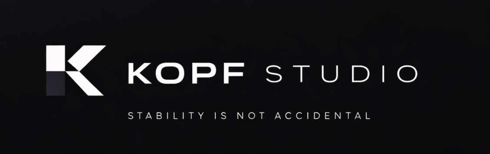

  

  <strong>Software engineering for ambitious companies</strong>

## Who We Are

Kopf Studio is the technology partner ambitious companies choose when standard software is no longer enough.

We design and build premium digital infrastructure: high-performance systems, robust backend architectures, intelligent automations, and custom platforms engineered to eliminate bottlenecks, improve execution, and create the foundation for sustainable scale.

Our work is guided by engineering discipline, operational clarity, and long-term thinking. We build software that is meant to perform in the real world — reliably, efficiently, and at scale.

## Core capabilities

- Custom platform engineering
- Backend systems and API architecture
- Intelligent business automation
- Internal systems and operational tooling
- Complex third-party integrations
- Scalable technical foundations
- Strategic engineering execution

## Engineering principles

We build with a long-term mindset.

Every system we design is expected to be:

- **Reliable in production**
- **Clear in architecture**
- **Maintainable over time**
- **Efficient in operation**
- **Aligned with business goals**
- **Capable of scaling with confidence**

We value depth over hype, structure over improvisation, and quality over unnecessary complexity.

## What sets us apart

Kopf Studio combines technical precision with business understanding.

We know companies do not need more software for the sake of software. They need better performance, smarter operations, and systems that support growth without creating fragility.

That is what we build.

## Ideal engagement areas

We are especially suited for initiatives involving:

- Backend-heavy products
- Platform modernization
- Process automation
- Integration-heavy environments
- Operational efficiency
- Architecture hardening
- Scalable internal tooling

## Contact

- LinkedIn: [Kopf Studio](https://www.linkedin.com/company/kopf33-studio)
